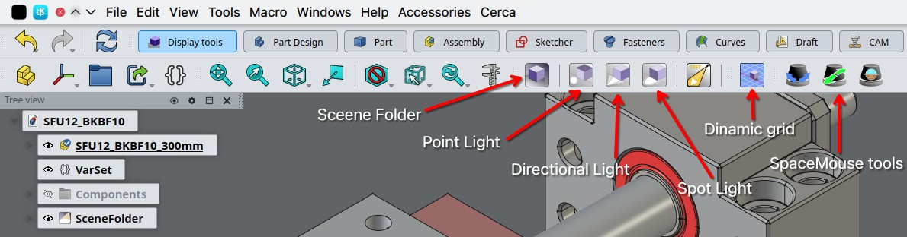
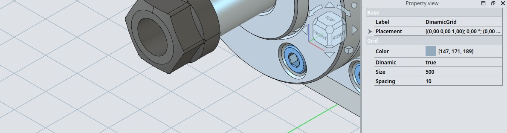
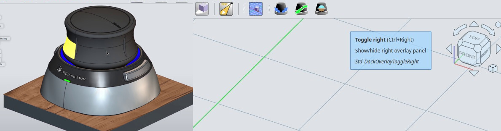

# FreeCAD Display Tools Workbench

### Support the Development

  
  
  
  
  

---

## FreeCAD Display Tools Workbench
This workbench aims to provide more refined control over your FreeCAD lighting and 3D viewing environment.

### Features

#### Enhanced Lighting

  

DisplayTools introduces dedicated light objects to FreeCAD, offering more flexible scene illumination compared to the default setup. These light types are equipped with interactive 3D manipulators in the viewport, allowing for precise positioning and aiming of light sources to better visualize model details and create compelling presentations

##### Point

##### Directional 

##### Spot Light

#### Configurable Dynamic Grid

  

The Dynamic Grid is designed to improve workspace clarity. This grid feature offers user-adjustable parameters for size, spacing, and color per document and in viewport. Its key functionality is to dynamically adapt its Z-position to the lowest extent of visible objects in the scene. This automatic adjustment aims to maintain a visually uncluttered workspace and improve focus on the model itself.

#### Spacemouse Navigation Utilities

  

Future iterations of DisplayTools are planned to incorporate utilities for users of 3Dconnexion Spacemice. The intention is to integrate helper tools such as rotation locking, translation locking, and horizon locking. These additions are intended to streamline 3D navigation for users employing a Spacemouse.

### Installation

#### Prerequisites

FreeCAD v1.0+

### Developer

OficineRobotica

### License
This project is licensed under the MIT License. See the [LICENSE](LICENSE) file for details.

